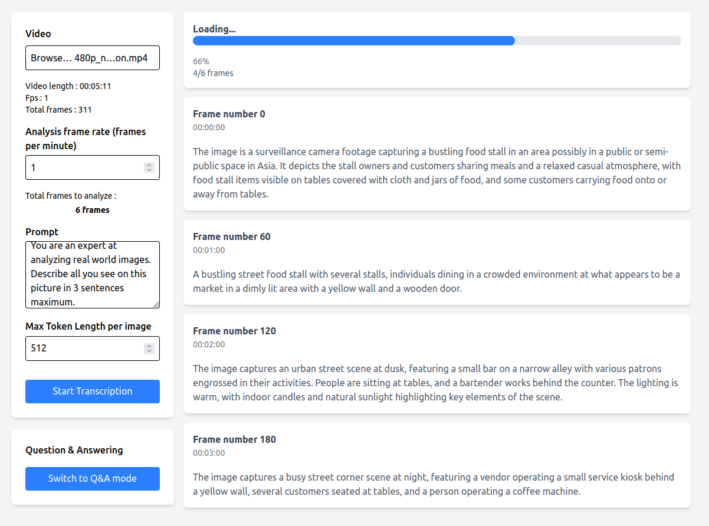
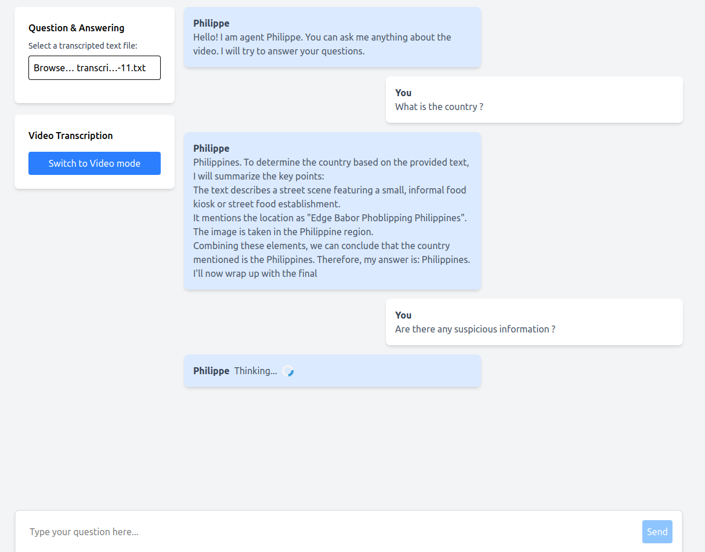
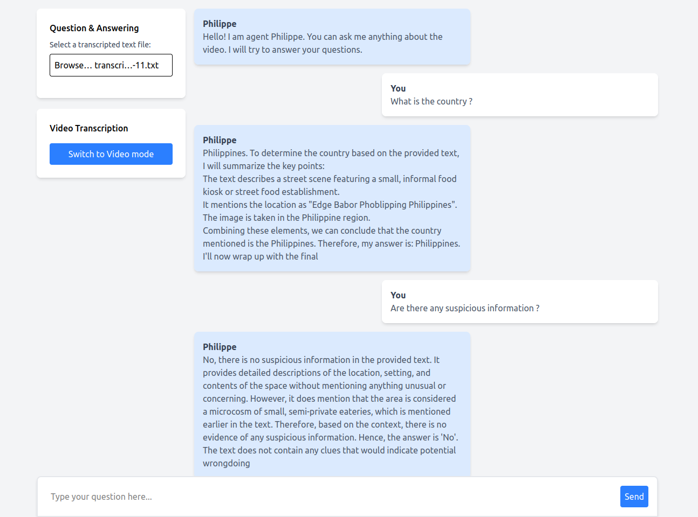

## Industrial Project - Telecom Nancy
Vision LLM - MINA

This industrial project aims to develop an embedded system capable of analyzing video streams in real-time by generating precise textual descriptions of the captured scenes. Integrated into an edge-computing environment, this system uses language models optimized to operate autonomously on an NVIDIA GPU card. The goal is to facilitate video analysis and reduce the size of transmitted data.

### `custom_evaluation`
Scripts to generate degraded videos and benchmark different Vision models.

### `interface`
Scripts to transcribe videos and chat with the transcription.

## Preview

The first image shows an example of video transcription, where the spoken content of a video is converted into text.

    

The second image demonstrates the Q&A mode, capturing the moment while the model is processing and thinking about the answer.

    

The third image presents the final response generated by the model in the Q&A session.

    

## Contribution

- Victor Voisin
- Clément G
- Victor Ménestrel
- Gianlucca Fiori Oliveira

## Version

v1.2